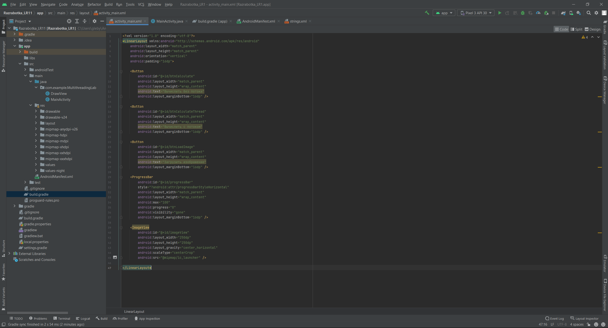
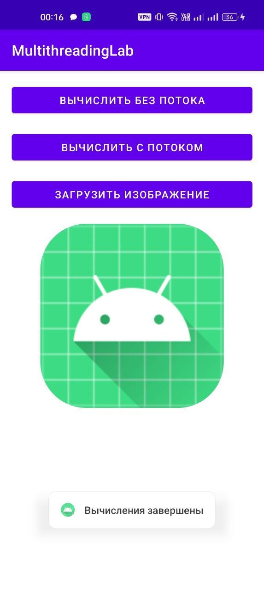
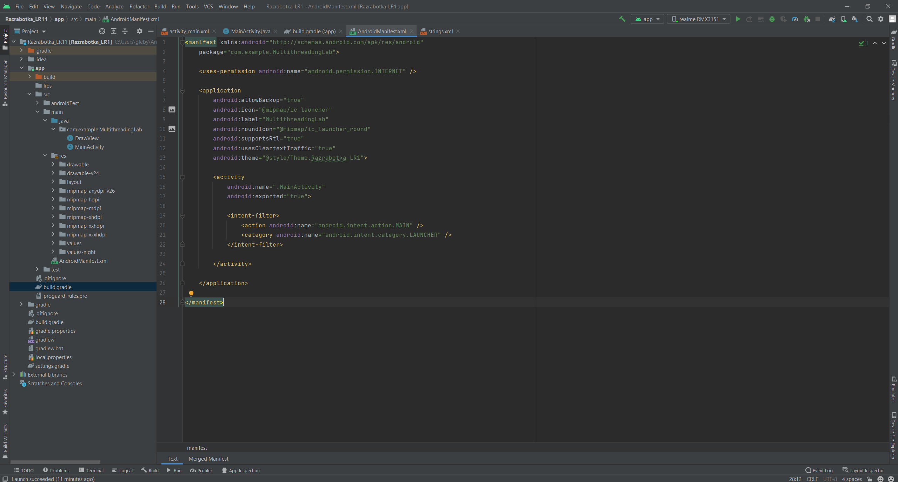
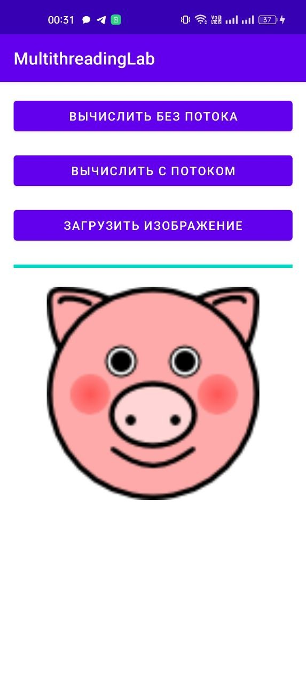
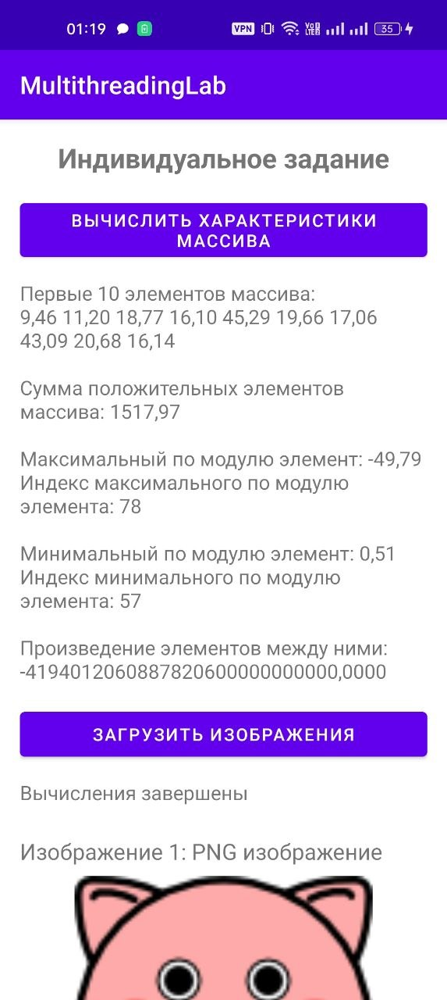
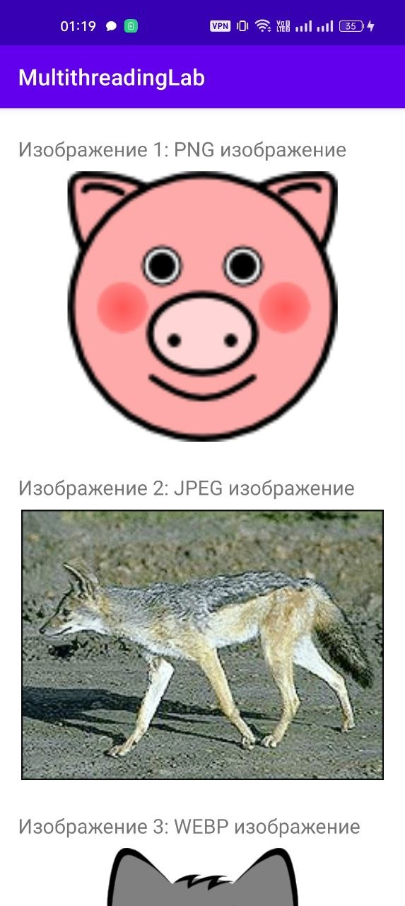
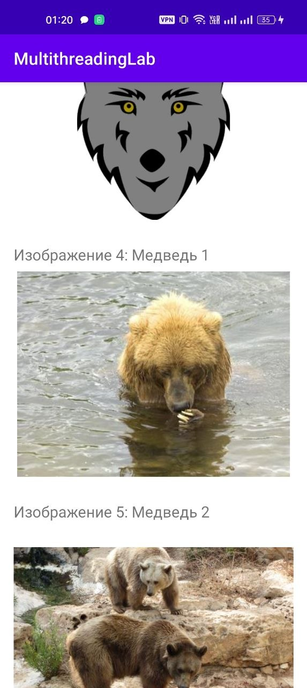

<div align="center">

# Отчет

</div>

<div align="center">

## Практическая работа №11

</div>

<div align="center">

## Многопоточность в Android. Асинхронная загрузка данных

</div>

**Выполнил:**  
Ржевский Константин Романович
**Курс:** 2  
**Группа:** ИНС-б-о-24-1

**Проверил:**   
Потапов И.Р. 

---

### Цель работы

Изучить принципы многопоточного программирования в Android. Научиться выносить длительные операции (вычисления, загрузка данных из сети) в фоновые потоки, чтобы избежать блокировки пользовательского интерфейса. Освоить способы обновления UI из фоновых потоков.


### Ход работы
1. Создайдим новый проект MultithreadingLab.
В файле activity_main.xml создадим интерфейс для выполнения вычислений и загрузки изображений.

<div align="center">



</div>

<div align="center">

*Рисунок 1. Настройка файла activity_main.xml*

</div> 

2.  Добавим в MainActivity.java метод, имитирующий длительные вычисления.
В обработчике кнопки btnCalculate вызовем этот метод напрямую.
Запустив приложение, оно работало с задержкой при нажатии кнопки.
После, в обработчике кнопки btnCalculateThread создадим новый поток и выполним вычисления в нём, после чего покажем Toast через runOnUiThread.

Код MainActivity.java:

<pre>
package com.example.MultithreadingLab;

import androidx.appcompat.app.AppCompatActivity;

import android.graphics.Bitmap;
import android.graphics.BitmapFactory;
import android.os.Bundle;
import android.util.Log;
import android.view.View;
import android.widget.Button;
import android.widget.ImageView;
import android.widget.ProgressBar;
import android.widget.Toast;

import java.io.InputStream;
import java.net.HttpURLConnection;
import java.net.URL;

public class MainActivity extends AppCompatActivity {

    private static final String TAG = "MultithreadingLab";

    private Button btnCalculate;
    private Button btnCalculateThread;
    private Button btnLoadImage;

    private ProgressBar progressBar;
    private ImageView imageView;

    @Override
    protected void onCreate(Bundle savedInstanceState) {
        super.onCreate(savedInstanceState);
        setContentView(R.layout.activity_main);

        btnCalculate = findViewById(R.id.btnCalculate);
        btnCalculateThread = findViewById(R.id.btnCalculateThread);
        btnLoadImage = findViewById(R.id.btnLoadImage);

        progressBar = findViewById(R.id.progressBar);
        imageView = findViewById(R.id.imageView);

        // Задание 2: вычисление без потока
        btnCalculate.setOnClickListener(v -> {
            longCalculation();
            Toast.makeText(this, "Вычисления завершены", Toast.LENGTH_SHORT).show();
        });

        // Задание 3: вычисление в отдельном потоке
        btnCalculateThread.setOnClickListener(v -> {
            new Thread(new Runnable() {
                @Override
                public void run() {
                    longCalculation();

                    runOnUiThread(new Runnable() {
                        @Override
                        public void run() {
                            Toast.makeText(MainActivity.this,
                                    "Вычисления в потоке завершены",
                                    Toast.LENGTH_SHORT).show();
                        }
                    });
                }
            }).start();
        });

        // Задание 4: загрузка изображения из интернета
        btnLoadImage.setOnClickListener(v -> {
            progressBar.setVisibility(View.VISIBLE);
            progressBar.setProgress(0);

            new Thread(new Runnable() {
                @Override
                public void run() {
                    try {
                        // Имитация прогресса загрузки
                        for (int i = 0; i <= 100; i += 10) {
                            Thread.sleep(200);

                            final int progress = i;

                            runOnUiThread(new Runnable() {
                                @Override
                                public void run() {
                                    progressBar.setProgress(progress);
                                }
                            });
                        }

                        // Реальная загрузка изображения
                        Bitmap bitmap = loadImage("http://httpbin.org/image/png");

                        runOnUiThread(new Runnable() {
                            @Override
                            public void run() {
                                imageView.setImageBitmap(bitmap);
                                progressBar.setVisibility(View.GONE);

                                Toast.makeText(MainActivity.this,
                                        "Изображение загружено",
                                        Toast.LENGTH_SHORT).show();
                            }
                        });

                    } catch (Exception e) {
                        e.printStackTrace();
                        Log.e(TAG, "Ошибка загрузки изображения", e);

                        runOnUiThread(new Runnable() {
                            @Override
                            public void run() {
                                progressBar.setVisibility(View.GONE);

                                Toast.makeText(MainActivity.this,
                                        "Ошибка загрузки изображения",
                                        Toast.LENGTH_SHORT).show();
                            }
                        });
                    }
                }
            }).start();
        });
    }

    // Метод для имитации длительных вычислений
    private void longCalculation() {
        long result = 0;

        for (long i = 0; i < 500000000L; i++) {
            result += i;
        }

        Log.d(TAG, "Результат: " + result);
    }

    // Метод загрузки изображения по URL
    private Bitmap loadImage(String urlString) throws Exception {
        URL url = new URL(urlString);
        HttpURLConnection connection = (HttpURLConnection) url.openConnection();

        connection.setDoInput(true);
        connection.setConnectTimeout(15000);
        connection.setReadTimeout(15000);
        connection.setRequestProperty("User-Agent", "Mozilla/5.0");

        connection.connect();

        int responseCode = connection.getResponseCode();

        if (responseCode != HttpURLConnection.HTTP_OK) {
            throw new Exception("Ошибка HTTP: " + responseCode);
        }

        InputStream input = connection.getInputStream();
        Bitmap bitmap = BitmapFactory.decodeStream(input);

        input.close();
        connection.disconnect();

        if (bitmap == null) {
            throw new Exception("Bitmap не был создан");
        }

        return bitmap;
    }
}
</pre>

Запустим приложение и нажмём кнопку — интерфейс теперь не зависает.

<div align="center">



</div>

<div align="center">

*Рисунок 2. Первый запуск приложения и проверка кнопки*

</div> 


3. Добавим разрешение INTERNET в AndroidManifest.xml.

<div align="center">



</div>

<div align="center">

*Рисунок 3. Настрйока AndroidManifest.xml*

</div> 

Создадим метод для загрузки изображения из сети (по URL). Используем HttpURLConnection или библиотеку OkHttp (для простоты — HttpURLConnection).
В обработчике кнопки btnLoadImage реализуйте загрузку в отдельном потоке с обновлением ProgressBar. Для демонстрации прогресса можно не отслеживать реальный прогресс загрузки, а имитировать его с помощью дополнительного цикла.
(это всё уже реализовано выше в коде MainActivity.java)

5. Запустим приложение, попробуем загрузить приложение:

<div align="center">



</div>

<div align="center">

*Рисунок 4. Результат приложения (Загрузка приложения)*

</div> 

<div align="center">

## ИНДИВИДУАЛЬНОЕ ЗАДАНИЕ

</div> 

6. Файл AndroidManifest.xml оставим без изменений.
В файле activity_main.xml создадим интерфейс для индивидуального задания.
Добавим кнопку для вычисления характеристик массива, TextView для вывода результата, кнопку для загрузки изображений, ProgressBar для отображения прогресса и LinearLayout, в который изображения будут добавляться динамически.

Код activity_main.xml:

```xml
<?xml version="1.0" encoding="utf-8"?>
<ScrollView xmlns:android="http://schemas.android.com/apk/res/android"
    android:layout_width="match_parent"
    android:layout_height="match_parent">

    <LinearLayout
        android:id="@+id/mainLayout"
        android:layout_width="match_parent"
        android:layout_height="wrap_content"
        android:orientation="vertical"
        android:padding="16dp">

        <TextView
            android:layout_width="match_parent"
            android:layout_height="wrap_content"
            android:text="Индивидуальное задание"
            android:textSize="22sp"
            android:textStyle="bold"
            android:gravity="center"
            android:layout_marginBottom="16dp" />

        <Button
            android:id="@+id/btnCalculateArray"
            android:layout_width="match_parent"
            android:layout_height="wrap_content"
            android:text="Вычислить характеристики массива"
            android:layout_marginBottom="12dp" />

        <TextView
            android:id="@+id/resultTextView"
            android:layout_width="match_parent"
            android:layout_height="wrap_content"
            android:text="Результат вычислений появится здесь"
            android:textSize="16sp"
            android:layout_marginBottom="16dp" />

        <Button
            android:id="@+id/btnLoadImages"
            android:layout_width="match_parent"
            android:layout_height="wrap_content"
            android:text="Загрузить изображения"
            android:layout_marginBottom="12dp" />

        <ProgressBar
            android:id="@+id/progressBar"
            style="?android:attr/progressBarStyleHorizontal"
            android:layout_width="match_parent"
            android:layout_height="wrap_content"
            android:max="100"
            android:progress="0"
            android:visibility="gone"
            android:layout_marginBottom="8dp" />

        <TextView
            android:id="@+id/progressTextView"
            android:layout_width="match_parent"
            android:layout_height="wrap_content"
            android:text=""
            android:textSize="16sp"
            android:layout_marginBottom="12dp" />

        <LinearLayout
            android:id="@+id/imagesContainer"
            android:layout_width="match_parent"
            android:layout_height="wrap_content"
            android:orientation="vertical" />

        <TextView
            android:layout_width="match_parent"
            android:layout_height="wrap_content"
            android:text="Юрьев Г.Е."
            android:gravity="center"
            android:layout_marginTop="20dp" />

    </LinearLayout>

</ScrollView>
```

7. В файле MainActivity.java реализуем генерацию массива из 100 вещественных элементов. Значения массива будут случайными в диапазоне от -50 до 50.
После генерации массива в фоновом потоке вычислим сумму положительных элементов, найдём максимальный по модулю и минимальный по модулю элементы, а затем вычислим произведение элементов, расположенных между ними.

Код MainActivity.java:

<pre>
package com.example.MultithreadingLab;

import androidx.appcompat.app.AppCompatActivity;

import android.graphics.Bitmap;
import android.graphics.BitmapFactory;
import android.os.Bundle;
import android.view.View;
import android.widget.Button;
import android.widget.ImageView;
import android.widget.LinearLayout;
import android.widget.ProgressBar;
import android.widget.TextView;
import android.widget.Toast;

import java.io.InputStream;
import java.net.HttpURLConnection;
import java.net.URL;
import java.util.Random;

public class MainActivity extends AppCompatActivity {

    private Button btnCalculateArray;
    private Button btnLoadImages;

    private TextView resultTextView;
    private TextView progressTextView;

    private ProgressBar progressBar;
    private LinearLayout imagesContainer;

    @Override
    protected void onCreate(Bundle savedInstanceState) {
        super.onCreate(savedInstanceState);
        setContentView(R.layout.activity_main);

        btnCalculateArray = findViewById(R.id.btnCalculateArray);
        btnLoadImages = findViewById(R.id.btnLoadImages);

        resultTextView = findViewById(R.id.resultTextView);
        progressTextView = findViewById(R.id.progressTextView);

        progressBar = findViewById(R.id.progressBar);
        imagesContainer = findViewById(R.id.imagesContainer);

        btnCalculateArray.setOnClickListener(new View.OnClickListener() {
            @Override
            public void onClick(View view) {
                calculateArrayInThread();
            }
        });

        btnLoadImages.setOnClickListener(new View.OnClickListener() {
            @Override
            public void onClick(View view) {
                loadImagesInThread();
            }
        });
    }

    private void calculateArrayInThread() {
        progressBar.setVisibility(View.VISIBLE);
        progressBar.setProgress(0);
        resultTextView.setText("Выполняются вычисления...");
        progressTextView.setText("Генерация массива...");

        new Thread(new Runnable() {
            @Override
            public void run() {
                try {
                    int n = 100;
                    double[] array = new double[n];
                    Random random = new Random();

                    for (int i = 0; i < n; i++) {
                        array[i] = -50 + random.nextDouble() * 100;

                        final int progress = (int) ((i + 1) * 50.0 / n);

                        runOnUiThread(new Runnable() {
                            @Override
                            public void run() {
                                progressBar.setProgress(progress);
                            }
                        });

                        Thread.sleep(20);
                    }

                    double positiveSum = 0;

                    for (int i = 0; i < n; i++) {
                        if (array[i] > 0) {
                            positiveSum += array[i];
                        }
                    }

                    int maxAbsIndex = 0;
                    int minAbsIndex = 0;

                    for (int i = 1; i < n; i++) {
                        if (Math.abs(array[i]) > Math.abs(array[maxAbsIndex])) {
                            maxAbsIndex = i;
                        }

                        if (Math.abs(array[i]) < Math.abs(array[minAbsIndex])) {
                            minAbsIndex = i;
                        }
                    }

                    int start = Math.min(maxAbsIndex, minAbsIndex) + 1;
                    int end = Math.max(maxAbsIndex, minAbsIndex);

                    double product = 1;
                    boolean hasElementsBetween = false;

                    for (int i = start; i < end; i++) {
                        product *= array[i];
                        hasElementsBetween = true;
                    }

                    if (!hasElementsBetween) {
                        product = 0;
                    }

                    final double finalPositiveSum = positiveSum;
                    final double finalProduct = product;
                    final int finalMaxAbsIndex = maxAbsIndex;
                    final int finalMinAbsIndex = minAbsIndex;

                    StringBuilder arrayText = new StringBuilder();
                    arrayText.append("Первые 10 элементов массива:\n");

                    for (int i = 0; i < 10; i++) {
                        arrayText.append(String.format("%.2f", array[i])).append(" ");
                    }

                    final String result =
                            arrayText.toString() +
                                    "\n\nСумма положительных элементов массива: " +
                                    String.format("%.2f", finalPositiveSum) +
                                    "\n\nМаксимальный по модулю элемент: " +
                                    String.format("%.2f", array[finalMaxAbsIndex]) +
                                    "\nИндекс максимального по модулю элемента: " + finalMaxAbsIndex +
                                    "\n\nМинимальный по модулю элемент: " +
                                    String.format("%.2f", array[finalMinAbsIndex]) +
                                    "\nИндекс минимального по модулю элемента: " + finalMinAbsIndex +
                                    "\n\nПроизведение элементов между ними: " +
                                    String.format("%.4f", finalProduct);

                    runOnUiThread(new Runnable() {
                        @Override
                        public void run() {
                            progressBar.setProgress(100);
                            resultTextView.setText(result);
                            progressBar.setVisibility(View.GONE);
                            progressTextView.setText("Вычисления завершены");
                        }
                    });

                } catch (Exception e) {
                    e.printStackTrace();

                    runOnUiThread(new Runnable() {
                        @Override
                        public void run() {
                            progressBar.setVisibility(View.GONE);
                            progressTextView.setText("Ошибка вычислений");
                        }
                    });
                }
            }
        }).start();
    }

    private void loadImagesInThread() {
        final String[] imageNames = {
                "PNG изображение",
                "JPEG изображение",
                "WEBP изображение",
                "Медведь 1",
                "Медведь 2"
        };

        final String[] imageUrls = {
                "http://httpbin.org/image/png",
                "http://httpbin.org/image/jpeg",
                "http://httpbin.org/image/webp",
                "https://placebear.com/400/300",
                "https://placebear.com/500/300"
        };

        imagesContainer.removeAllViews();

        progressBar.setVisibility(View.VISIBLE);
        progressBar.setProgress(0);
        progressTextView.setText("Загружено 0 из " + imageUrls.length);

        new Thread(new Runnable() {
            @Override
            public void run() {
                for (int i = 0; i < imageUrls.length; i++) {
                    try {
                        final Bitmap bitmap = loadImage(imageUrls[i]);

                        final int currentIndex = i + 1;
                        final int progress = (int) (currentIndex * 100.0 / imageUrls.length);
                        final String currentName = imageNames[i];

                        runOnUiThread(new Runnable() {
                            @Override
                            public void run() {
                                TextView label = new TextView(MainActivity.this);
                                label.setText("Изображение " + currentIndex + ": " + currentName);
                                label.setTextSize(18);
                                label.setPadding(0, dpToPx(12), 0, dpToPx(8));

                                ImageView imageView = new ImageView(MainActivity.this);

                                LinearLayout.LayoutParams params =
                                        new LinearLayout.LayoutParams(
                                                LinearLayout.LayoutParams.MATCH_PARENT,
                                                dpToPx(240)
                                        );

                                params.setMargins(0, 0, 0, dpToPx(16));

                                imageView.setLayoutParams(params);
                                imageView.setScaleType(ImageView.ScaleType.CENTER_CROP);
                                imageView.setAdjustViewBounds(true);
                                imageView.setImageBitmap(bitmap);

                                imagesContainer.addView(label);
                                imagesContainer.addView(imageView);

                                progressBar.setProgress(progress);
                                progressTextView.setText("Загружено "
                                        + currentIndex + " из " + imageUrls.length);
                            }
                        });

                    } catch (Exception e) {
                        e.printStackTrace();

                        final int errorIndex = i + 1;

                        runOnUiThread(new Runnable() {
                            @Override
                            public void run() {
                                progressTextView.setText("Ошибка загрузки изображения №"
                                        + errorIndex);

                                Toast.makeText(MainActivity.this,
                                        "Ошибка загрузки изображения №" + errorIndex,
                                        Toast.LENGTH_SHORT).show();
                            }
                        });
                    }
                }

                runOnUiThread(new Runnable() {
                    @Override
                    public void run() {
                        progressBar.setVisibility(View.GONE);

                        Toast.makeText(MainActivity.this,
                                "Загрузка изображений завершена",
                                Toast.LENGTH_SHORT).show();
                    }
                });
            }
        }).start();
    }

    private Bitmap loadImage(String urlString) throws Exception {
        URL url = new URL(urlString);
        HttpURLConnection connection = (HttpURLConnection) url.openConnection();

        connection.setDoInput(true);
        connection.setConnectTimeout(15000);
        connection.setReadTimeout(15000);
        connection.setInstanceFollowRedirects(true);
        connection.setRequestProperty("User-Agent", "Mozilla/5.0");

        connection.connect();

        int responseCode = connection.getResponseCode();

        if (responseCode != HttpURLConnection.HTTP_OK) {
            throw new Exception("Ошибка HTTP: " + responseCode);
        }

        InputStream input = connection.getInputStream();
        Bitmap bitmap = BitmapFactory.decodeStream(input);

        input.close();
        connection.disconnect();

        if (bitmap == null) {
            throw new Exception("Bitmap не был создан");
        }

        return bitmap;
    }

    private int dpToPx(int dp) {
        return (int) (dp * getResources().getDisplayMetrics().density);
    }
}
</pre>

Для загрузки изображений был создан массив из пяти URL-адресов. Изображения загружаются последовательно в фоновом потоке с помощью HttpURLConnection.
После загрузки каждого изображения обновляется ProgressBar и текст прогресса, например: «Загружено 1 из 5». Каждое изображение добавляется в контейнер imagesContainer через новый ImageView, созданный программно.

8. Запустим приложение и посмотрим результат:

<div align="center">



</div>

<div align="center">

*Рисунок 5. Результат приложения (1)*

</div> 

<div align="center">



</div>

<div align="center">

*Рисунок 6. Результат приложения (2)*

</div> 

<div align="center">



</div>

<div align="center">

*Рисунок 7. Результат приложения (3)*

</div> 

### Вывод
В ходе практической работы были изучены принципы многопоточности в Android-приложениях и способы выполнения длительных операций в фоновом потоке. Было реализовано приложение, в котором генерируется одномерный массив вещественных чисел и вычисляются его характеристики: сумма положительных элементов и произведение элементов между максимальным и минимальным по модулю элементами. Для выполнения вычислений использовался отдельный поток, поэтому интерфейс приложения не блокировался во время работы. Также была реализована последовательная загрузка изображений из интернета с отображением прогресса через ProgressBar. После загрузки изображения динамически добавлялись в LinearLayout с помощью ImageView. Практическая работа позволила закрепить навыки работы с потоками, обновлением интерфейса через runOnUiThread(), загрузкой данных из сети и отображением результатов на экране.
### Ответы на контрольные вопросы
1.  **Вопрос 1: Что такое главный (UI) поток? Почему нельзя выполнять длительные операции в нём?** 
Главный UI-поток — это поток, который отвечает за отображение интерфейса и обработку действий пользователя. Длительные операции в нём выполнять нельзя, потому что приложение может зависнуть.
2.  **Вопрос 2: Что такое ANR (Application Not Responding)? При каких условиях возникает?**
ANR — это ошибка «Application Not Responding», то есть приложение не отвечает. Она возникает, если главный поток слишком долго занят тяжёлой операцией и не реагирует на действия пользователя.
3.  **Вопрос 3: Как создать новый поток в Java? Как запустить выполнение кода в этом потоке?**
Новый поток в Java создаётся через new Thread(). Код помещается в метод run(), а запуск выполняется методом start().
4. **Вопрос 4: Почему нельзя обновлять UI из фонового потока напрямую? Как правильно обновить интерфейс из другого потока?**
UI нельзя обновлять из фонового потока напрямую, потому что интерфейс Android должен изменяться только в главном потоке. Правильно использовать runOnUiThread() или Handler.
5. **Вопрос 5: Для чего используется класс Handler? Как с его помощью отправить сообщение в UI-поток?** 
Handler используется для передачи задач или сообщений в другой поток, чаще всего в UI-поток. Для этого создают Handler с Looper.getMainLooper() и вызывают метод post().
6. **Вопрос 6: Что такое ExecutorService? В чём его преимущество перед созданием потоков вручную?** 
ExecutorService — это механизм для управления потоками. Его преимущество в том, что он удобнее и безопаснее, чем постоянное ручное создание новых потоков.
7. **Вопрос 7: Почему AsyncTask считается устаревшим? Какие альтернативы рекомендуется использовать?** 
AsyncTask считается устаревшим, потому что он плохо подходит для современных требований Android и может приводить к проблемам с жизненным циклом приложения. Вместо него рекомендуют использовать ExecutorService, Handler, WorkManager или Kotlin Coroutines.
8. **Вопрос 8: Как отобразить прогресс выполнения длительной операции с помощью ProgressBar?** 
Для отображения прогресса используется ProgressBar. Перед началом операции его показывают через setVisibility(View.VISIBLE), во время работы обновляют через setProgress(), а после завершения скрывают через setVisibility(View.GONE).
